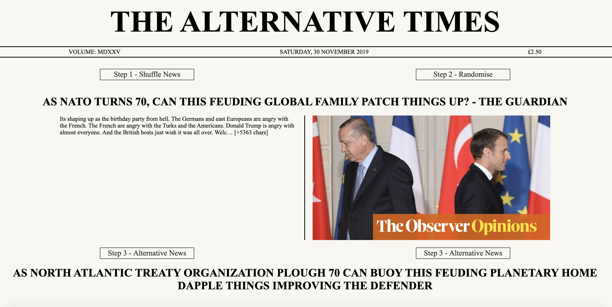

# GA Project 2 - The Alternative Times

Design based on the British newspaper 'The Times' this project is a website that requests the top UK News stories from News API and then passes the headline through Words API to create an alternative headline from word associations. This was the second project I completed during the General Assembly Software Engineering Immersive (bootcamp) course.

## Resources

* The Times [Newspaper](https://www.thetimes.co.uk/)
* The Times - [Wikipedia](https://en.wikipedia.org/wiki/The_Times)
* [News API](https://newsapi.org/)
* [Words API](https://www.wordsapi.com/)

## Built With

* HTML5
* SCSS
* JavaScript
* React
* Axios
* npm
* NewsAPI and WordsAPI
* Git / GitHub

## Timeframe

2 day pair Hackathon with [Paul Cooke](https://github.com/paulcooke)

## Deployment

This website is deployed on [Heroku](https://alternativenews.herokuapp.com/)



---

## Getting Started

Use the clone button to download the source code. In your terminal enter the following commands:

### To install all the packages listed in the package.json:
$ npm i

### Run the app on your localhost:
$ npm run serve

## To Use

To get your alternative news headline (hopefully with hilarious outcomes)

- Click on *Step 1 - Shuffle News* at least once to get a news story to affect
- Click on *Step 2 - Randomise* to prepare your selected news story for the final step
- Click on either of the *Step 3 - Alternative News* buttons to get your alternative news story headline (each button will provide a slightly different perspective)
- Enjoy your alternative news story
- Repeat as required

---

## Architecture and Challenges

- Dealing with gaps in information - the Words API doesn't hold information on all words, so some control flow had to be included to deal with missing/undefined data. As shown by the following code, words that could not be converted are simply returned as their original word:

```js
if (typeof this.state.fakeHeadlineObject[word] === 'string') {
        // console.log('string:', word)
        return word
      } else if (typeof this.state.fakeHeadlineObject[word] === 'undefined') {
        // console.log('undefined:', word)
        return word
```

- The number of API requests we were sending to Words API - we introduced a minimum word length to prevent requests to replace short words such as 'at' or 'and'. This decision was made to maintain legibility of alternative headline and ensure API calls weren't excessive.

```js
if (word.length < 3) {
        fakeHeadlineObject[word] = word
      } else {
        axios.get(`https://wordsapiv1.p.rapidapi.com/words/${word}`, {
          headers: { 
            'x-rapidapi-host': 'wordsapiv1.p.rapidapi.com',
            'x-rapidapi-key': wordsKey
          } })
          .then(res => fakeHeadlineObject[word] = res.data)
          .catch(() => fakeHeadlineObject[word] = word)
      } 
```

- Punctuation in headline's retrieved from News API caused errors as the Words API couldn't recognise the words with the additional characters. We removed as much punctiation as possible with a Regex filter, this still insn't perfect but works approximately 80% of the time.

```js
getStory() {
    const newsKey = process.env.NEWSAPI_ACCESS_KEY
    axios.get(`https://newsapi.org//v2/top-headlines?country=gb&apiKey=${newsKey}`)
      .then(res => this.setState({ articles: res.data.articles, originalHeadline: res.data.articles[0].title.toLowerCase().split(/[. ,:;\-_']+/) }))
      .catch(err => this.setState({ error: err.message }))
  }
```

---

## Wins

The wins associated with this project were:

* A greater understanding of the Promise object in JavaScript
* Simple styling, with large impact
* Combining components in React

---

## Key Learning Points

The key learning points associated with this project were:

* The importance of communication in pair programming
* Greater experience interacting with external API's
* RegEx's are complicated but essential
* Hackathon's are fun!

---

## Future Improvements

This project was fast paced due to the 48 hour time restriction but also lots of fun. I enjoyed working with my partner, Paul, as we communicated well together. We had many more ideas for implementation than we had time to implement but were both really impressed with what we created. I created a much more advanced project that I would have done working solo, much was learnt from the pair-programming experience.

Advancements that could be made in the future to improve this website include:

- Ability to Switch between News genres (e.g. Entertainment, Sport, Science & Technology)
- Ability to share new headlines on social media accounts with friends
- Improved RegEx to ensure maximum headline translation
- Reduce number of buttons required to get to your alterntive headline.

## Author - Mary-Anne Triggs

Please visit my personal [portfolio](www.maryannetriggs.com)